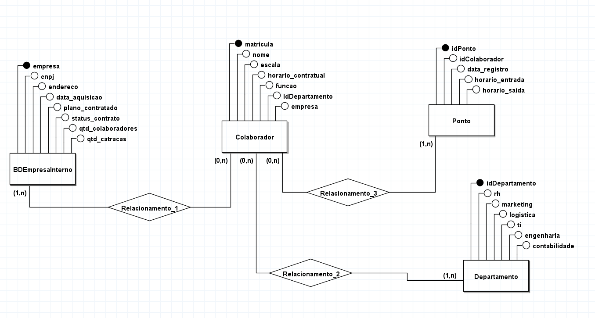

<h1 align="center">Projeto Catraca</h1>

<p align="center">
  Sistema de controle de acesso corporativo por reconhecimento facial integrado a catraca física, ESP32 e banco de dados relacional multi-empresa.
</p>

<p align="center">
  
  
  
  
  
  
  
</p>

---

## 📖 Sobre o projeto

O **Projeto Catraca** é um sistema completo de controle de acesso corporativo que combina **visão computacional**, **IoT** e **backend web**. Ao detectar e reconhecer o rosto de um colaborador via câmera, o sistema registra automaticamente a entrada ou saída no banco de dados MySQL e aciona a catraca física via ESP32.

O sistema é **multi-empresa**, com planos contratados (Starter, Pro, Ultra) e verificação de status de contrato em tempo real antes de liberar o acesso.

Desenvolvido como projeto acadêmico de Engenharia da Computação.

---

## 🏗️ Arquitetura do sistema

```
┌──────────────────────────┐      HTTP POST (JSON)     ┌─────────────────────────┐
│  Câmera + Python          │ ────────────────────────► │  API PHP (Insert.php)   │
│  face_recognition         │ ◄───────────────────────  │  MySQL (Ponto, Backup)  │
│  encoding → pickle→base64 │   { status, nome, ... }  │  Trigger → Backup       │
│  cooldown local (5s)      │                           │  cooldown PHP (20s)     │
│  verifica empresa ativa   │                           └─────────────────────────┘
└──────────────────────────┘                                       │
                                                           select.php (polling)
                                                                   │
                                                       ┌───────────▼───────────┐
                                                       │  ESP32 (OPS010)       │
                                                       │  Wi-Fi GET a cada 5s  │
                                                       │  Y1 → aciona catraca  │
                                                       └───────────────────────┘

┌──────────────────────────┐    ┌──────────────────────────┐
│  cadastrodepessoa.py      │    │  interfacerh.py           │
│  Tkinter + OpenCV         │    │  Tkinter + Treeview       │
│  Captura foto e salva     │    │  CRUD de colaboradores    │
│  encoding no MySQL        │    │  visualiza BackupPonto    │
└──────────────────────────┘    └──────────────────────────┘
```

---

## ✨ Funcionalidades

**Reconhecimento e acesso**
- Detecção facial em tempo real com `face_recognition` + OpenCV
- Encoding facial serializado com `pickle` e armazenado como BLOB no MySQL
- Verificação de empresa ativa antes de liberar o acesso
- Cooldown duplo: 5s local (Python) + 20s na API PHP — evita duplo-registro

**Registro de ponto**
- Primeira passagem do dia → `INSERT` em `Ponto` (horariosaida = NULL)
- Trigger copia automaticamente para `BackupPontoCompleto`
- Passagem subsequente → `UPDATE` de horario_saida em `BackupPontoCompleto` + novo `INSERT` em `Ponto`

**Interface de gestão (RH)**
- Cadastro facial via webcam com interface Tkinter
- Painel de gestão de colaboradores: adicionar, editar, excluir, buscar
- Visualização do histórico de pontos (`BackupPontoCompleto`)
- Ordenação por coluna e filtro em tempo real

**Hardware (ESP32)**
- Polling HTTP a cada 5 segundos para `select.php`
- Acionamento do pino Y1 (catraca) ao detectar registro válido
- Tabela `Ponto` é esvaziada após leitura pelo ESP32 (dados preservados no Backup)
- Sensor DHT22 para temperatura/umidade
- Controlador OPS010: 8 entradas digitais, 8 saídas digitais, 1 entrada analógica, 1 saída analógica

**Protótipo alternativo**
- `TesteIATeacheblemachine.html` — versão web com TensorFlow.js + Teachable Machine para reconhecimento no navegador

---

## 🛠️ Stack

| Camada | Tecnologia |
|---|---|
| Reconhecimento facial | Python 3, `face_recognition`, `dlib`, OpenCV |
| Interface desktop | Python `tkinter`, `ttk` |
| API backend | PHP 8.x (MySQLi) |
| Banco de dados | MySQL (multi-empresa, triggers, FKs) |
| Hardware IoT | ESP32 + Arduino IDE (C++) |
| Sensor ambiental | DHT22 |
| Controlador | OPS010 (I/O digital e analógico) |
| Protótipo web | TensorFlow.js, Teachable Machine |

---

## 🗄️ Banco de dados

### Tabelas

| Tabela | Descrição |
|---|---|
| `BDEmpresaInterno` | Clientes do sistema (CNPJ, plano, status do contrato) |
| `Departamento` | Setores por empresa |
| `Colaborador` | Dados do colaborador + encoding facial (BLOB) + `last_punch_timestamp` |
| `Ponto` | Registros brutos de passagem (entrada/saída) |
| `BackupPontoCompleto` | Espelho consolidado gerado por trigger — fonte principal de relatórios |

### Lógica de registro de ponto

```
Passagem 1 (entrada)
  → INSERT Ponto (horariosaida = NULL)
  → TRIGGER copia para BackupPontoCompleto (horario_saida = NULL)

Passagem 2 (saída)
  → UPDATE BackupPontoCompleto SET horario_saida = agora
  → INSERT Ponto com horario_entrada original + horario_saida atual

ESP32 faz GET em select.php
  → Lê Ponto → aciona Y1
  → DELETE FROM Ponto (dados seguros no Backup)
```

---

## 🚀 Como rodar

### Pré-requisitos

```bash
pip install face_recognition opencv-python mysql-connector-python requests
```

### 1. Banco de dados

```bash
mysql -u root -p < DBAIekson.SQL
```

### 2. API PHP

Configure as credenciais em `Insert.php` e `select.php`:

```php
$host     = "seu_host:3306";
$username = "usuario";
$password = "senha";
$dbname   = "banco";
```

Faça deploy em servidor Apache/Nginx ou Replit.

### 3. Cadastro facial

```bash
python cadastrodepessoa.py
```

Selecione um colaborador já cadastrado no MySQL pela matrícula, capture a foto e o encoding será salvo automaticamente.

### 4. Reconhecimento

```bash
python reconhecimento.py
```

Aponte a câmera para o rosto de um colaborador cadastrado. O ponto é registrado automaticamente via API.

### 5. Interface RH

```bash
python interfacerh.py
```

### 6. ESP32

Abra `Software_Base_OPS010_ESP32.ino` na Arduino IDE:

```cpp
const char* ssid       = "SUA_REDE";
const char* password   = "SUA_SENHA";
const char* serverName = "https://seu-servidor.com/select.php";
```

---

## 📁 Estrutura do repositório

```
projeto-catraca/
├── python/
│   ├── reconhecimento.py          # Reconhecimento facial em tempo real + envio para API
│   ├── cadastrodepessoa.py        # Cadastro de encoding facial no MySQL
│   ├── interfacerh.py             # Interface de gestão RH (Tkinter)
│   ├── testereconhecimento.py     # Teste com banco SQLite local
│   └── testecadastrodepessoa.py   # Teste de cadastro com SQLite
├── api/
│   ├── Insert.php                 # Registro de ponto (entrada/saída) com anti-duplo
│   └── select.php                 # Consulta + esvaziamento da tabela Ponto (para ESP32)
├── firmware/
│   └── Software_Base_OPS010_ESP32.ino
├── web/
│   └── TesteIATeacheblemachine.html  # Protótipo com TensorFlow.js
├── banco/
│   └── DBAIekson.SQL              # DDL completo com triggers, FKs e CHECKs
├── docs/
│   ├── conceitual.png
│   └── BANCO_DE_DADOS.PNG
└── README.md
```

---

## 📸 Diagramas

| Modelo Conceitual | Estrutura BD |
|---|---|
|  |  |

---

## 👩‍💻 Autora

Desenvolvido por **[Julyxdias](https://github.com/Julyxdias)** e Karol Helena — Engenharia da Computação.

Orientação: Prof. André · Prof. Saulo

---

<p align="center"><sub>Projeto acadêmico • 2025</sub></p>
